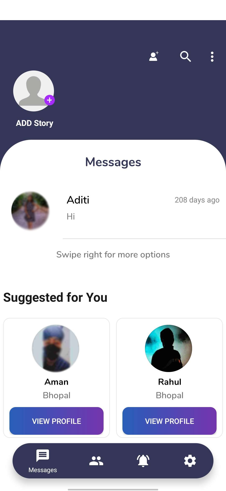
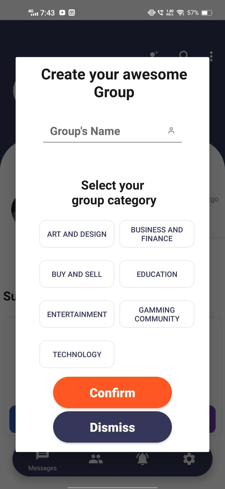
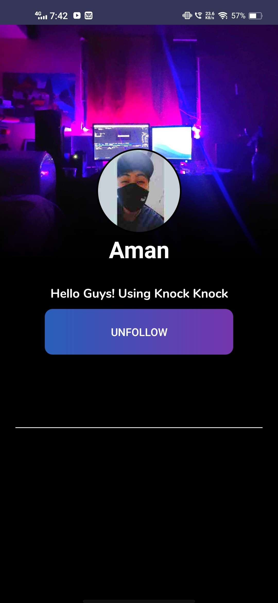
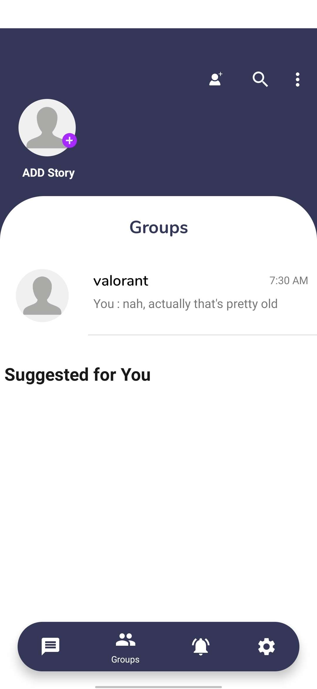
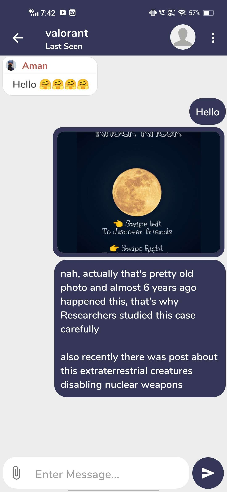
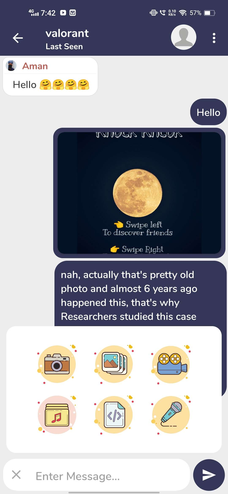
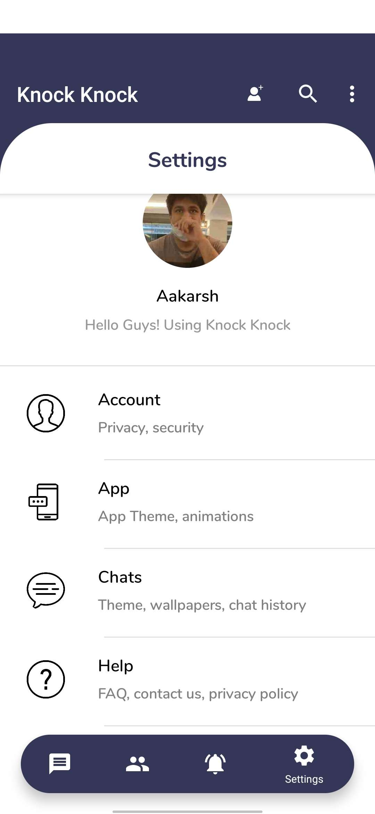
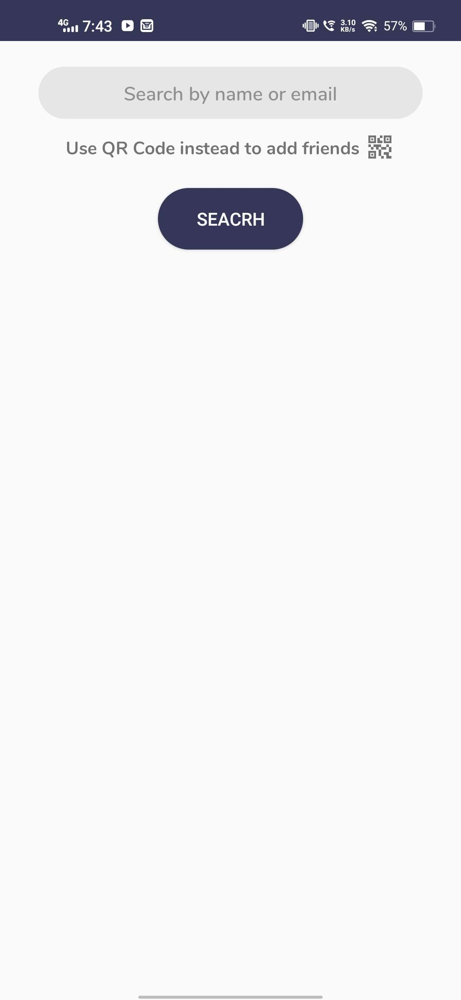

# Knock knock - Firebase Messenger App 2018
A messenger app is **any app that enables a private messaging function between two or more people**. With more and more messenger apps popping up every day, this type of technology is quickly becoming the most popular way to send text-based messages, replacing SMS and MMS as the preference of most consumers.

This app was created in 2018 with the help of YouTube tutorials of [Akshay bhaiya](https://www.youtube.com/@TVACStudio/videos)
After completion of the tutorial I manipulated major codes of the app and made it an advance version of the app with more facilities like group chat, profile picture change, wall picture, status etc. and also changed the whole UI of the app by learning from here and there.
This was the first app of my life and this project helped me to learn full native android development.

This app is purely based on firebase. So to use the app you have to enable **Firebase realtime database, Firebase Storage, Firebase Authentication - with email** .

# Based on
Lapit chat app - https://github.com/yudikarma/Lapit---Android-Firebase-Chat-App
or you can say that an advance version of [Lapit chat app](https://github.com/yudikarma/Lapit---Android-Firebase-Chat-App)

# App Screenshots🎉

<table>
  <tr>
    <td>First Screen Page</td>
     <td>Creating groups</td>
     <td>Profile page</td>
    <td>Groups page</td>
    <td>Group chat page</td>
    <td>Group chat options</td>
    <td>Accounts page</td>
    <td>Search Friend page</td>
  </tr>
  <tr>
    <td> </td>
    <td> </td>
    <td> </td>
    <td> </td>
    <td> </td>
    <td> </td>
    <td> </td>
    <td> </td>
  </tr>
 </table>

# Configure Firebase 👀
- Create your own project on firebase. 
- download google-services.json 
- Place it in the app folder
- Setup Realtime database in firebase and enable the database by setting true to read & write in the rules tab of relatime database.
- Setup Storage in firebase and enable it by setting true to read and write in the rules of storage. 
- Setup authentication in firebase and enable email/password authentication.
- You are good to go.👌👌

# License
MIT License

Copyright (c) 2022 Rahul

Permission is hereby granted, free of charge, to any person obtaining a copy
of this software and associated documentation files (the "Software"), to deal
in the Software without restriction, including without limitation the rights
to use, copy, modify, merge, publish, distribute, sublicense, and/or sell
copies of the Software, and to permit persons to whom the Software is
furnished to do so, subject to the following conditions:

The above copyright notice and this permission notice shall be included in all
copies or substantial portions of the Software.

THE SOFTWARE IS PROVIDED "AS IS", WITHOUT WARRANTY OF ANY KIND, EXPRESS OR
IMPLIED, INCLUDING BUT NOT LIMITED TO THE WARRANTIES OF MERCHANTABILITY,
FITNESS FOR A PARTICULAR PURPOSE AND NONINFRINGEMENT. IN NO EVENT SHALL THE
AUTHORS OR COPYRIGHT HOLDERS BE LIABLE FOR ANY CLAIM, DAMAGES OR OTHER
LIABILITY, WHETHER IN AN ACTION OF CONTRACT, TORT OR OTHERWISE, ARISING FROM,
OUT OF OR IN CONNECTION WITH THE SOFTWARE OR THE USE OR OTHER DEALINGS IN THE
SOFTWARE.
